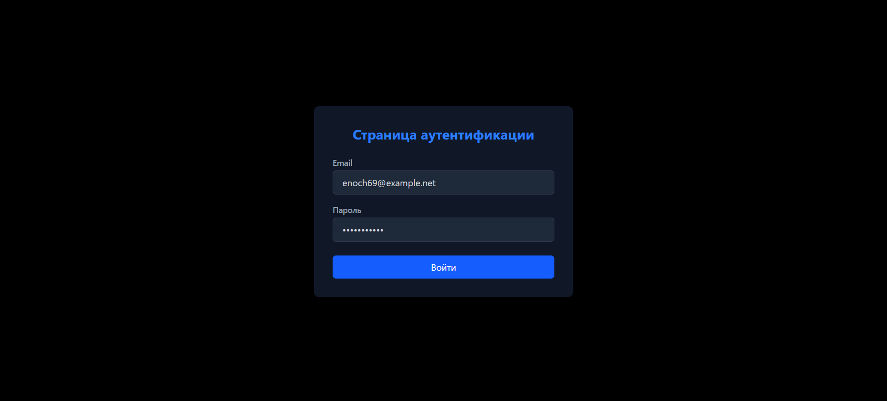
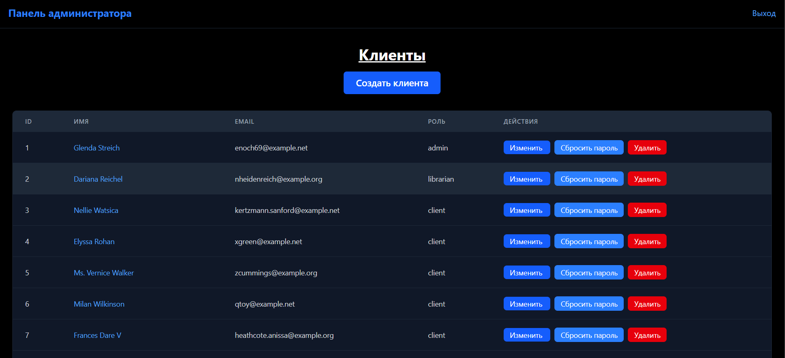
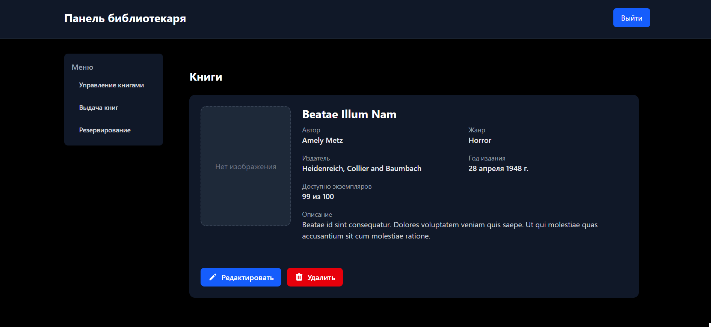
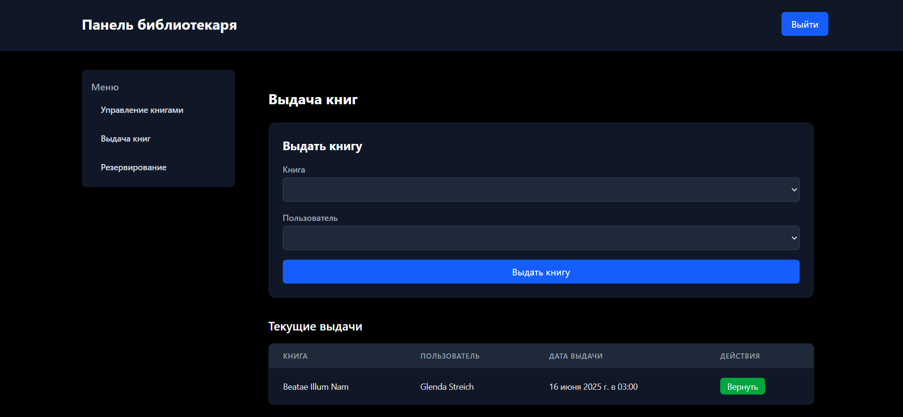
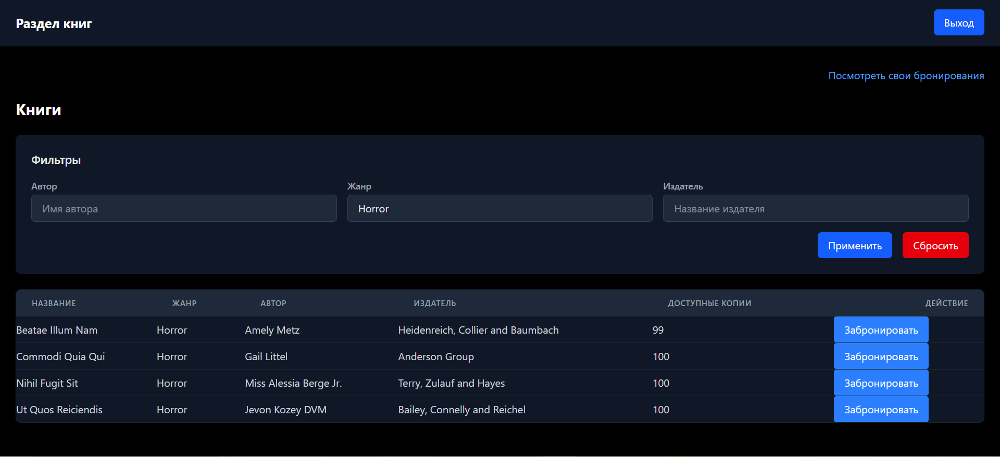
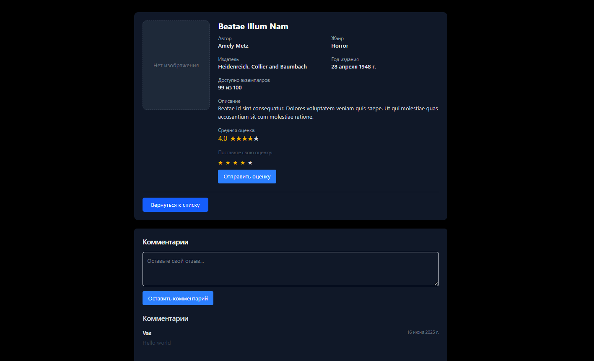

# 📚 library-app


## 🛠 Built With
- **Vue.js** - Frontend framework
- **Laravel** - Backend framework

## 🧰 Технологический стек

### 🔙 Бэкенд:
- **Laravel 12** — PHP-фреймворк для API
- **PostgreSQL** — СУБД
- **RESTful JSON API** 
- **Laravel Sanctum** — Авторизация через токены

### 🖥 Фронтенд:
- **Vue 3** — реактивный JS-фреймворк
- **Vuex** — управление состоянием
- **Vue Router** — маршрутизация
- **TailwindCSS** — утилитарный CSS-фреймворк
- **Vite** — сборщик проекта

## 🚀 Установка и запуск

```bash
git clone https://github.com/Unslslov/library-app.git
cd library-app
```

## ⚙️ Настройка backend (Laravel)

# Перейди в папку backend
cd backend

# Скопируй .env.example в .env
cp .env.example .env

# Установи зависимости через Composer
composer install

# Сгенерируй APP_KEY
php artisan key:generate

# Подними контейнеры Docker (первый запуск)
./vendor/bin/sail up -d

# Выполни миграции и сиды внутри контейнера
php artisan migrate --seed

# Запустите Laravel проект
php artisan serve

# API будет доступен по адресу: 
http://127.0.0.1:8000/api

## 🎨 Настройка frontend (Vue + Tailwind)

# Перейди в папку frontend
cd frontend

# Установи зависимости
npm install

# Запустите Vue проект
npm run dev

# Доступен по адресу: 
http://localhost:5174

## 📡 Примеры API-запросов

# Получить список пользователей
GET /api/clients

# Ответ:
```json
{ 
    "id": 1,
    "name": "Иван Иванов",
    "email": "ivan@example.com"
}
```

# Создать нового клиента
POST /api/clients

# Body (JSON):
```json
{
    "name": "Алексей Петров",
    "email": "alex@example.com"
}
```

# Ответ:
```json
{
  "user": {
    "id": 2,
    "name": "Алексей Петров",
    "email": "alex@example.com",
    "role": {
      "id": 3,
      "name": "client"
    }
  }
}
```

## 📸 Скриншоты:

# Авторизация


# страница администратора:
Админ-панель


# страница библиотекаря:
Информация о книге


Выдача книги


# страница клиента:
Клиент-панель


Информация о книге
